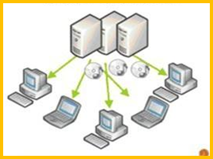

# quick start

## 视角

```markmap
# 因特网

## 硬件构成

- 路由器
- 交换机

## 软件构成

- HTTP
- FTP

## 结构

- 主干网
- 区域主干网
- 接入网

## 服务视角

- 向应用程序提供服务的基础设施提供统一的套接字编程接口
```

## 什么是协议

与人类之间交流的语言(协议)

| 语言 |                   协议                   |
| :--: | :--------------------------------------: |
| 语法 |           实体间交换报文的格式           |
| 语义 | 报文的意义和发送与接收报文时所采取的动作 |
| 同步 |              报文交换的次序              |


## 网络划分

### 网络边缘

- 主机：客户机/服务器

  端系统

- 位于数据中心的服务器

### 网络核心

- 路由器
- 网络的网络

## 通信方式

- 客户/服务器模型(C/S)

  

- 对等模型（P2P）

  

- 混合模型（C/S+P2P）

  

## 电路交换

Circuit Switching

### 数据交换过程


1. 建立连接
2. 交换数据
3. 释放连接

### 复用


### 网络特性

- 数据交换前需建立起一条从发端到收端的物理通路
- 在数据交换的全部时间内用户始终占用端到端的固定传输信道
- 交换双方可实时进行数据交换而不会存在任何延迟

### 问题

- 计算机之间的数据交换往往具有**突发性**和**间歇性**特征，而对电路交换而言，用户支付的费用则是按用户占用线路的时间来收费的

- 不够灵活。只要在通话双方建立的通路中的任何一点出了故障，就必须重新拨号建立新的连接，这对紧急和重要通信是很不利的。

## 分组交换

packet switching

### 动机

- 不是为了打电话，而是用于计算机之间的数据传送
- 能够连接不同类型的计算机
- 所有的网络结点同等重要，不能有特别重要的结点
- 必须有冗余路由
- 网络结构尽可能简单，能够可靠传送数据


### 模型


?> A 发送 P1 给 B, B 会存储 P1, 当 A 发送 P2 给 B 时, B 会将 P1 发送给 C

- 将要发送的报文分解层若干个小部分，称为分组
- 在每个交换节点采用存储转发技术
- 每个分组可能传送的路径不同
- 节点之间存在冗余路由

---

首部都含有地址等控制信息

结点交换机必须根据首部中的地址信息，选择路由，把分组转发到下一个结点交换机

---

P1, 与 P2 目的一样,但是路径可能不同

!> 分组路径可能变化

### 特征

- 被传送的数据分成若干分组分别传送
- 数据传输前不必预先确定分组的传输路径
- 网络核心中每个交换结点均为共享结点
- 数据传输采用存储/转发模式
- 各节点具有选择合适路由的能力

网络核心断续(动态)分配传输带宽，使得通信线路的利用率得以大大提高

网络核心常采用网状拓扑结构，降低拥塞或故障时的影响

## 分组交换 VS 电路交换

假设：1Mbps 的链路，每个用户需要 100kbps

- 电路交换

  仅支持 10 个用户(1Mbps/100kbps)

- 分组交换

  分组交换下 1 个用户活跃的概率为 0.1
  35 个用户条件下，11 个及以上用户同时活动的概率为 0.0004,即 10 个及 10 个以内用户同时活跃的概率为 0.9996,基本上与电路交换性能相当

> 在相同条件下，分组交换能够比电路交换支持更多的用户。

---

同一时刻仅有一个用户传输 1M 的数据, 电路建立时间可忽略不计

- 电路交换所需时间：10s
- 分组交换所需时间：1s

> 当用户数较少时，分组交换能够获得比电路交换更好的性能。

---


将 L 长的分组传输 (推送出去)到链路（速率为 R bps）要花费 L/R 秒

当整个分组到达路由器后才能向下条链路传输: 存储转发

时延 = 3L/R

> 在数据量大时，分组交换的传输时延比电路交换大

---

分组在各结点存储转发时因要排队总会造成一定的**时延**。当网络通信量过大时，这种时延可能会很大。

各分组必须携带一定的控制信息（说明信息），从而带来额外**开销**。

整个分组交换网的管理和控制比较**复杂**

---

若要**连续传送大量数据**，且其传送时间远大于呼叫建立时间，则采用在数据通信之前预先分配传输带宽的电路交换较为合适

分组交换不需要预先分配传输带宽，在传送**突发数据**时可提高整个网络的信道利用率

## ISP 连接

internet service provider

|                                     |                                     |
| :---------------------------------: | :---------------------------------: |
|  |  |

## 数据丢失和产生时延的原因

数据不断从设备推送到网络上，需要花费一定的时间，推送的速度受到网络带宽的影响。

数据不断从链路的一端传送到链路的另一端，需要花费一定的时间，传送速度受到电子传送速度影响。

设备接收数据以及决定往哪转发数据，这些处理需要花费一定的时间，处理时间受设备硬件的影响。

路由器接收到的数据需要排队以便按顺序转发和调节接收与转发速度的不一致，排队需要花费一些时间，排队时间受设备硬件的影响。

当数据队列已满时，再收到的数据只能丢掉。

当报文网络中传输，路由形成了环路，无法传送到目标节点时，这个报文也只能丢掉

$$总时延=处理时延+排队时延+传输时延+传播时延$$

## 层次化的网络体系结构

### 航空例子


> 票务部似乎就与票务部对接, 其他都是透明的. 而且信息时携带的, 票务部添加了票的信息, 飞机上有航道信息, 到了目的票务处, 会检验票

如何简明表达顺序依赖关系和对等工作关系

---

- 应用程序
- 多进程通信
- 资源复用
- 路由选择
- 各种不同介质链路上的通信
- 可靠通信
- 提高效率

需要很多协议，才能解决这些问题，形成了协议簇


### 优势

- 协议之间的调用关系明确

- 模块化简化了系统的维护和升级

- 某个层次服务实现的改变对系统的其余部分是透明的

### 劣势

- 不是所有协议关系都能归结为两层之间
- 偶尔会出现

  - 隔层调用服务的现象
  - 或者下层调用上层的现象

## 基本概念

实体(Entity)

实体是任何可以发送和接收信息的硬件和软件进程。通常是一个特定的软件模块。

---

对等体(Peer)

不同机器上包含对应层的实体称为对等体。

---

服务(Service)

为保证上层对等体之间能互相通信，下层向上层提供的功能。

---

接口(Interface)

接口位于每对相邻层之间，定义了下层向上层提供的原语操作和服务。

?> service 与 interface 的区别

---

协议数据单元(PDU)

协议数据单元是对等层次上传送数据的单位

---

服务数据单元(SDU)

服务数据单元是层与层之间交换数据的单位

---

网络体系结构(Network Architecture)

网络体系结构就是层和协议的集合

---

协议栈(Protocol Stack)

一个特定的系统所使用的一系列协议（每层一组协议）

## 网络体系结构模型

Network Architecture Model

- 常使用的模型：

  因特网的五层模型

- 具有理论意义的模型:

  国际标准化组织（ISO）提出的： 开放系统互连七层模型（OSI）

### 因特网


### ISO


### 数据的流动


> 交换机会有'链路层'的概念, 会对数据校验, 而路由器有'网络层'的概念, 会规划路径
