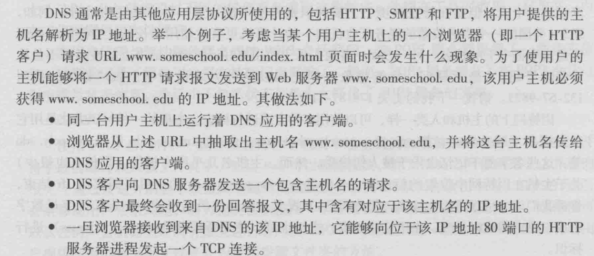
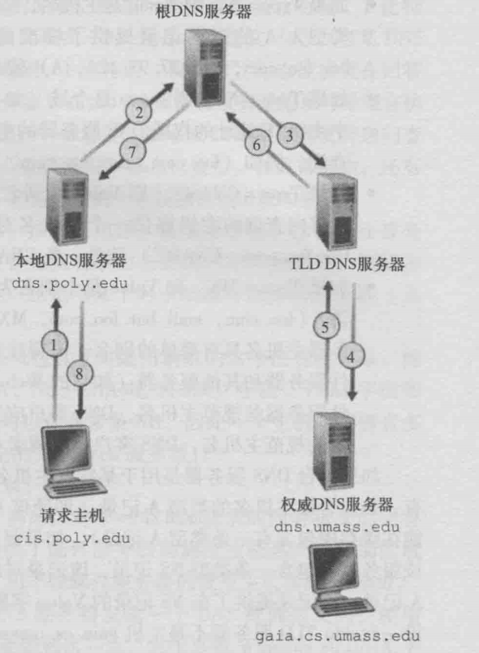
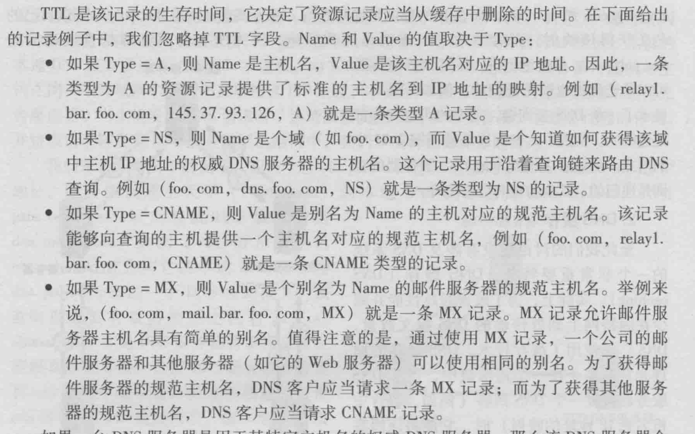
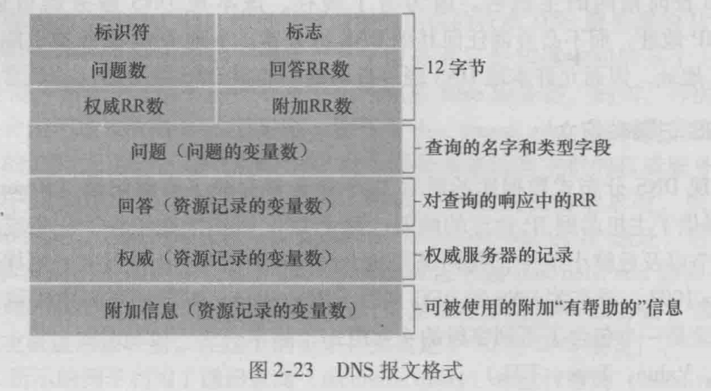
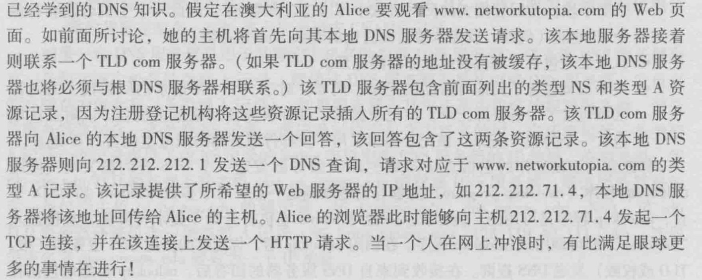

# 计算机网络

## 第一章、计算机网络和因特网

### 一些理解

- 分布式应用程序通过网络通信链路实现的数据端对端的发送。
- 核心是问答的流程，也就是协议的核心

### 网络边缘

- 端系统：网络终端设备

### 接入网

- 家庭
  
  - DSL
    - 通过数字用户线接入调制和解调器来交换数据，最后汇集到中心局（DSLAM），呈现集中分布式
  - 同轴电缆或混合光纤同轴
    - 同轴电缆汇集到光纤结点再传输到地区枢纽（电缆头端，电缆调制解调器）
  - FTTH
    - 光纤直接到户，没有分叉，本地中心局直接到用户。
  - 拨号
    - 家庭调制解调器经过电话线接入到ISP中的一直调制解调器，但速度很慢
  - 卫星
    - 卫星链路将住宅与因特网相连

- 企业
  
  - 局域网（LAN）
    - 用户通过双绞铜线接入网络交换机，以太网交换机再与更大的因特网连接。
    - WIFI无线接入，接入点与企业网（很可能是有线的以太网）。

- 广域无线网接入
  
  位于基站数万米内便可连接。
  
  - 3G
  - LTE

### 物理媒介

- 引导型媒介
  - 光缆、双绞线、同轴电缆
- 非引导型媒介
  - 电磁波在空间或外层空间的传播（无限局域网和数字卫星频道）

### 网络核心

互联因特网端系统的分组交换机和链路构成的网络。

- 分组交换
  
  - 将报文划分为较小的数据块，每个分组都通过通信链路和分组交换机传送
  - 存储转发传输
    - 串行传输，同一时刻一条链路上可以同时进行传输，但单点上只能有一个在传输，其他需要排队
  - 排队时延和分组丢失
    - 输出队列，数据量超过了存储路由器的的传输速度，后来的需要排队，如果缓存已经满了，分组将会被丢弃。
  - 转发表（映射表）和路由选择协议
    - 路由根据目的端系统的IP地址，并向相邻的路由转发分组，每台路由都有一个转发表，用于将目的地址映射成为输出链路，路由会检查IP地址并搜索转发表，确定合适的出链路，将分组转发。

- 电路交换
  
  - 通过频分复用或者时分复用来实现
    - 时分复用：给每个预定的用户分配固定的时间片，不管是否活跃连接期间均占用
    - 分组交换在传输静默期可以让出资源（按需分配），可以提供更多的用户连接，因为用户同时进行传输的概率低。

- 网络的网络
  
  实现ISP互联
  
  - 单一全球承载ISP互联所有接入的ISP，但耗资巨大
  - 多个全球ISP互联，这些ISP互联，并且这些ISP为其他ISP提供互联服务，别的ISP也可以选择合适自己的全球承载ISP服务
  - 层级网络结构，顶层ISP互联，较底层的ISP接入高层的ISP。

- 分组交换网中的时延、丢包和吞吐量
  
  端系统之间引入时延，并且允许丢失分组，限制吞吐量。
  
  - 分组交换中的时延概述
    
    - 传输中的时延最主要的是结点处理时延、排队时延、传输时延和传播时延，这些时延总和为结点总时延。
      
      传输时延和传播时延的比较：传输时延是路由器的出数据速度，而传播时延是在物理媒介上的传输速度。
  
  - 排队时延
    
    - 到达路由缓存队列的分组的平均速率是a，分组的大小为L，La (bps)为比特到达队列的速率，R为路由的传输速率，如果La/R<1，随着时间累加，队列会趋于无限长，La/R也被称为流量强度。（设计系统时流量不能大于1）
  
  - 丢包
    
    - 当队列已满时，又有一个新的分组到达时，路由器将丢弃该分组，分组丢失
      
      丢失的包需要考虑端到端的重传，确保所有的数据最终都能传输到目的地
  
  - 计算机网络中的吞吐量
    
    - 链路上最慢的传输速率，短板效应，不然会出现比特流在最慢处积压的现象。
    - 吞吐量取决于数据流过的链路的传输

## 应用层

### 应用层协议原理

核心是实现一种能够运行在不同的端系统上并通过网络彼此通信的程序

- 网络应用层体系结构
  
  - 客户-服务器结构体系
    
    例如Web应用程序
  
  - 对等（P2P）体系结构

- 进程通信
  
  - 进程与计算机网络直接的接口：套接字API
    
    应用程序可以控制套接字在应用层端的一切，但对于传输层的控制只限于
    
    1. 传输层协议的选择
    2. 几个传输层参数设定（如最大缓存和最大报文段长度）
  
  - 进程寻址
    
    - 主机的地址（IP地址）
    - 定义在目的主机中的接收进程的标识符（应用程序的端口号）

- 可供应用程序使用的传输服务
  
  - 可靠数据传输
    
    防止数据丢失或干扰
  
  - 吞吐量
    
    传输线路上的传输bit速率
  
  - 定时（时延）
    
    传输时延，实时性
  
  - 安全性
    
    传输数据加密和解密、数据完整性和端点鉴别

- 因特网提供的传输层服务
  
  - TCP
    - 面向连接的服务，3次握手TCP连接
    - 可靠数据传输服务，无差错、顺序正确，没有字节丢失和冗余
    - 拥塞机制，当双方出现网络拥塞的情况时，TCP拥塞机制会抑制发送程序，同时拥塞机制限制每个连接，使他们公平共享网络带宽
    - 加密的传输层协议，加强版的TCP——SSl，有一套新的套接字API。
  - UDP
    - 不提供不必要服务的轻量级传输层协议
    - 无连接的不可靠数据传输
    - 没有拥塞机制，发送端可以以任何速率向下层注入数据

- 应用层协议
  
  - 应用层协议只是网络应用的一部分
  - 应用层协议定义了端系统上的应用层序如何相互传递报文
    - 交换的报文类型，如请求报文和响应报文
    - 各种报文类型的语法，各个字段和字段如何描述
    - 字段的语义，即字段中包含的信息
    - 一个进程何时以及如何发送报文，对报文的响应规则

### Web和HTTP

Web的按需操作和导航

- HTTP概况
  
  - Web术语
    - Web页面由对象组成，如一个HTML文件、一个JPEG图片等，他们可通过一个URL地址寻址
    - URL地址由两部分组成：主机名和对象的路径名
  - HTTP定义了Web客户向服务器请求Web页面的方式，以及服务器向客户传送Web页面的方式（交互）。
  - HTTP使用TCP作为支撑的传输协议，因此HTTP协议无需担心数据丢失和乱序问题，那是TCP以及协议栈低层协议的工作
  - HTTP服务器不保存客户的任何信息，是一个无状态协议。

- 非持续连接和持续连接
  
  - 非持续连接：每个请求/响应对是经一个单独的TCP连接发送
    
    传送一个Web页面过程：
    
    - 客户端和服务端套接字连接（TCP连接）
    - 通过套接字向服务器发送一个HTTP请求报文，包含想要访问的路径名
    - HTTP服务器接收到请求报文后检索出对象，在HTTP响应报文中封装对象，并通过套接字发送响应报文
    - HTTP客户接收报文，HTTP服务器请求断开TCP连接，会直到确认接收完响应报文才实际中断连接。
  
  - 持续连接：所有请求和响应经过相同的TCP连接发送

- HTTP报文格式
  
  - 请求报文
    
    第一行为请求行，其他行为首部行
    
    请求行有三个字段：方法字段、URL字段和HTTP版本字段
    
    方法包括GET、POST、HEAD、PUT、DELETE
    
    首部行可以理解为请求的设置
  
  - 响应报文：包含三部分
    
    初始状态行、首部行、实体体

- 用户与服务器交互：cookie
  
  识别用户，用于记录和跟踪用户在Web服务器上的信息和活动，但因为可能侵犯隐私，存在争议

- Web缓存
  
  Web缓存器有自己的磁盘存储空间，存储最近请求过的对象的副本，可以配置用户的浏览器，使得用户的所有HTTP请求首先指向Web缓存

### 文件传输协议：FTP

FTP使用两个并行的TCP来传输文件，一个用于控制的TCP连接，一个用于数据传输的TCP连接

控制连接贯穿整个会话过程，数据连接是非持续的，每一次文件传输都需要建立新的数据连接

- FTP服务器在会话过程中必须保留用户的状态，需要把特定的用户和控制连接联系起来，必须跟踪用户在目录树上的当前位置，这也限制了FTP能同时维持的会话数。

- FTP命令和回答
  
  每个命令由4个大写字母ASCLL字符组成，还有可选参数
  
  回答是一个3位的数字，后跟一个可选信息

### 因特网中的电子邮件

电子邮件有三个主要组成部分：**用户代理、邮件服务器和简单邮件传输协议**

- SMTP是因特网电子邮件应用的核心，用于从发送方的邮件服务器发送报文到接收方的邮件服务器
- 邮件访问协议，用于从邮件接收服务器上获取邮件并读取：POP3、IMAP（相比POP3多了文件夹和报文相关联）、基于Web的电子邮件（通过浏览器与邮件服务器简历连接读取邮件）

### DNS

- DNS是：
1. 一个由分层的DNS服务器实现的分布式数据库

2. 一个是的主机能够查询分布式数据库的应用层协议

3. DNS通过采用位于网络边缘的客户和服务器，实现了关键的名字到地址转换的功能。
   
   

4. 使用DNS来获得主机别名（一个主机可能拥有多个别名）

5. 邮件服务器别名，解析出邮件服务器主机的别名得到IP
- DNS工作原理
  
  - 将主机名转换为IP地址返回给查找这个转换的主机
  
  - 需要DNS服务器存储这些转换对
  
  - 为了减少转换的时延，采用分布式、层次存储
    
    - 根DNS服务器，有多个，他们之间为冗余的关系，提供足够的安全性和可靠性
    
    - 根DNS服务器下有顶级域（DNS）服务器、权威DNS服务器
    
    - 还有一种重要的DNS，本地DNS服务器，每个ISP都有一台本地DNS服务器，当获取主机与IP转换的请求发送往本地DNS服务器，这个服务器起着代理作用，将请求转发到DNS服务器层次结构中，也就是上面所说的层次存储（配合上缓存加快转换的速度）
      
      
    
    - DNS缓存：将回答的信息缓存在本地存储器中，下一次相同的请求，DNS服务器就能直接提高所要求的的IP地址
      
      
    
    - DNS记录和报文
      
      资源记录是一个包含以下字段的四元组：（Name，Value，Type，TTL）
      
      Name和Value决定Type
      
      
      
      - DNS报文格式
        
        
      
      - 在DNS数据库插入记录
        
        要注册域名，需要向注册登记机构提供基本和辅助权威DNS服务器的名字和IP地址，注册机构将确保将一个类型NS和一个类型A的记录输入TLD com服务器，并且自己还要确保用于Web服务器的类型A资源记录和用于邮件服务器的类型MX资源记录被输入到自己的全为DNS服务器中。（后面才能被解析和访问）
        
        

### P2P应用

> 数据不用总是从服务器发送到每一个对等方，但服务器至少发送该份数据的每一个bit位一次。之后对等方在他们之间可以重新发送。

> P2P结构体系的应用程序能够自扩展：原因是对等方除了是下载者，他们还是上载者。

- BitTorrent（文件分发的流行P2P协议）
  - 参与一个特定文件的所有对等方的集合称为洪流
  - 当一个对等方首次加入一个洪流时，他没有块。随着时间的流逝，他积累了越来越多块，下载了很多块的同时也上载了很多块。一旦某个对等方获取了整个文件，可以选择离开，也可以选择无私地为其他对等方上载块。
  - 每个洪流有一个基础设施结点，称为跟踪器，用于后续分发其他在该节点下的对等方作为邻居，建立TCP连接。
  - 稀缺优先技术：决定了对等方优先获取哪些块和决定应该先发送哪些块，这样能够使得稀缺资源在洪流中快速发送，均衡了每个块在洪流中的副本数量。
  - 对等方总会在一定时间测量接收比特的速率，给那些当前能够以最高速率提供数据的对等方给出优先权。
- 分布式散列表（DHT）
  - 实现一个简单的数据库，使用散列函数将键值和整数值进行一个映射（哈希）
  - 环形DHT
    - 环形询问查找到负责的对等方。
    - 由于一个环形查找速度较慢，在环形的基础上加上一些捷径，形参了有**捷径的环形DHT**，实现O(logN)的查找效率
  - 对等方扰动
    - 某些对等方在退出时，此时的DHT结构会变化，更新的规则跟链表类似。

### TCP/UDP套接字

- UDP套接字
  
  UDP的客户端在接收来自服务器返回的信息时不需要获取服务器的地址信息，因为它本来一开始就已经知道了
  
  而服务器接收到客户端信息时，需要保存客户端的信息，后续处理完数据进行一个发送返回。
  
  ```
  //服务端
  socket()
  bind()
  recvfrom()
  //客户端
  socket()
  sendto()
  ```

- TCP套接字
  
  首先需要握手创建一个TCP连接，发生了传输层的三次握手，服务器监听并接收到这个连接信息后，将套接字与TCP套接字绑定（欢迎套接字），随后生成一个进行绑定的用于数据传输的套接字（连接套接字）
  
  ```
  //服务端
  socket()
  bind()
  listen()
  accept()
  recv()
  send()
  //客户端
  socket()
  connect()
  send()
  ```

## 传输层

- 为运行在不同主机上的应用程序提供直接的通信服务起重要作用
- 关键问题：传输层原理和原理在协议中怎么实现（TCP/UDP传输层协议）
- TCP怎么在传输数据会丢失的情况下进行可靠地通信。

### 概述和传输层服务

- 传输层为运行在不同主机上的进程提供了逻辑通信
  
  > 逻辑通信：物理距离远，但通过路由器和多种链路设备进行链路相连，该层无需考虑底层承载这些报文的物流基础设施。

- 传输层和网络层关系
  
  - 网络层提供的是**主机之间的逻辑通信**，而传输层提供的是不同主机上**进程的逻辑通信**。
  - 传输层中工作在端系统中，将报文移动到**网络边缘**，传输层会由于底层网络协议的不可靠的时延和带宽导致无法为应用层提供可靠的时延和带宽。但对于底层数据传输的不可靠，网络层协议会使分组丢失、篡改和冗余，传输层协议也能提供可靠的准确的数据传输，并且由于网络层协议不能保证报文段的机密，而传输层也能使用加密来确保应用程序报文不被入侵者读取。

- 传输层概述
  
  - 提供了两种不同的传输层协议
    
    - TCP（传输控制协议）：可靠的面向连接的服务
    - UDP（用户数据报协议）：不可靠、无连接服务
  
  - 了解传输层之前先了解一下网络层：IP（网际协议），为主机之间提供了逻辑通信
    
    IP服务模型是尽力而为交付服务，尽力在主机之间交付报文段，但是不做任何确保，不保证顺序，不保证完整，所以IP是不可靠服务。
  
  - TCP和UDP的基本职责是将两个端系统之间IP的交付服务扩展为运行在端系统上的两个进程之间的交付服务
  
  - 主机间的交付扩展到进程间称为传输层的多路复用和多路分解
  
  - UDP和TCP还可以通过在报文段首部中包括差错检查字段提供完整性检查
  
  - 进程到进程的数据交付和差错检查是两种最低限度的传输层服务，也是UDP所提供的的仅有的两种服务
  
  - TCP提供了几种附加的服务
    
    - 可靠的数据传输
      
      > 使用流量控制、序号、确认和定时器，确保争取的按序将数据从发送进程交付给接收进程
    
    - 拥塞控制
      
      > 带来了通用好处的服务，TCP拥塞机制防止任何一条TCP连接用过多流量淹没通信主机之间的链路和交换设备，力求每个通过一条拥塞网络链路的连接平等的共享网络链路带宽，通过调节TCP连接的发送端的流量速率做到。

### 多路复用和多路分解

> 多路复用和多路分解是所有计算机网络都需要的

一个终端主机可能会运行多个网络应用进程，这时需要将数据定向到这几个网络应用进程中的一个

- 套接字相当于网络向进程传递数据和进程向网络传递数据的门户

- 传输层实际上没有直接将数据交付给进程，而是将数据给了一个中间的套接字，所以只要套接字进行标识，一个网络应用进程可以有多个套接字，每个套接字都有唯一的标识符

- 在某层的单一协议何时被位于接下来的较高层的多个协议使用有关，多路分解。

- 多路复用的要求：
  
  1. 套接字有唯一的标识符
  
  2. 每个报文段有特殊的字段（源端口号字段、目的端口字段）来指示该报文段所要交付到的套接字
     
     > 周知端口号为0-1023,在RFC1700中给出

- 服务器实现一个服务端一个进程有多个套接字，并且分时处理多个套接字的数据，是通过多线程实现（线程池）（轻量级进程）

#### 多路分解（信息分发）

- 将传输层报文段中的数据交付到正确的套接字的工作
- 主机的每个套接字能够分配一个端口号，报文段到达主机时，传输层检查报文段中的端口号并定向到对应的端口号，数据通过套接字进入所连接的进程

#### 多路复用（信息汇聚）

- 源主机从不同套接字中收集数据块并为数据块封装上首部信息从而生成报文段，将报文段传输到网络层，这些工作成为多路复用

### 无连接传输：UDP

- 基本上相当于与IP打交道，UDP从其他进程得到数据，附加上用于多路复用/多路分解功能及少量的差错检测外，几乎没有新增别的东西。
  
  > UDP从进程得到数据，附加上用于多路复用/多路分解的源和目的端口号字段，以及其他两个小字段，形参报文段交给网络层，网络层将传输层报文段封装到一个IP数据报中，然后就是尽力交付到接收主机。

#### UDP适用情况：

- 关于何时、发送什么数据的应用层控制更为精细。
  
  实时应用，不希望过分的延迟报文段传送
  
  可以容忍数据丢失

- 无需建立连接，进一步降低时延

- 无连接状态。TCP需要有接收和发送缓存、拥塞控制参数以及序号和确认号的参数，这些状态都是需要跟踪的，无连接状态也因此让UDP可以支持更多的活跃用户。

- 分组首部开销小。TCP报文段都有20字节开销，UDP只有8字节开销

#### 网络应用及其使用的传输协议


#### UDP报文段结构


源端口号和目的端口号用于执行分解功能，长度字段指示UDP报文段中的字节数（首部加上数据）

校验和用于差错检测，检测出错误只能丢弃分组，将报文段交给应用程序并给出警告

- UDP检验和
  
  - 用于检测报文段中的bit是否发生了改变。
  
  - 发送方将报文段所有16比特字的和进行反码运算，求和遇到任何溢出都被回卷。
    
    > 回卷就是最高位溢出，需要将1和这次运算的结果进行加和

#### 可靠的数据传输原理

- 可靠数据传输的框架
  
  - 为上层实体提供抽象服务
    
    数据通过一条可靠的信道进行传输，使用可靠信道，传输数据比特就不会受到损坏或者丢失，所有数据都是按发送顺序进行交付。
  
  - 实现这种服务抽象是可靠数据传输协议的责任，阻碍这种协议的实现的是其下层协议也许是不可靠的。
  
  - 考虑到底层信道的不可靠，需要实现一个可靠数据传输协议的发送方和接收方
    
    考虑底层信道损坏比特或者丢失整个分组时，需要怎么样的协议机制，并且需要考虑导致的分组顺序问题

- 可靠数据传输协议的迭代
  
  - 协议1.0：假设底层通信信道是不会出现bit错误，并且数据能马上被接收方接收
  
  - 协议2.0：存在比特差错信道（数据可能受损或者丢失）
    
    - 在原本传输数据的基础上加上自动重传请求协议（ARQ）
    
    - 需要三种功能来支持
      
      1. 差错检测
      2. 接收方反馈（ACK or NAK）
      3. 重传
    
    - 发送端两个状态：发送状态和等待应答状态，在等待应答时不能从上层获取更多的数据
    
    - 接收端一个状态，接收数据并做出
    
    - 这样的一个协议被称为**停等协议**
    
    - 忽略了应答信号也会出现比特差错，并且一旦应答信号出现差错，发送方无法知道接收方是否接收到
      
      > 应答信号受损的三种可能性：
      > 
      > 1. 发送方不理解来自接收方的回答时，引入一种新型的分组（发送方发给接收方）接收方接收到后复述其上一次回答
      > 2. 增加足够的检验和比特，是发送方不进可以检测差错，还可以恢复差错，对于产生差错但是不丢失分组的信道就可以直接解决问题
      > 3. 发送方收到含糊不清的ACK或NAK分组时，只要重传当前数据分组即可，这样引入了冗余分组，添加了冗余分组存在一个问题，就是接收方不知道冗余分组算冗余还是新的分组，解决方法是在数据分组中加一个字段，发送方对数组分组进行编号

- 协议2.1：（分组没有丢失的情况）
  
  - 发送方开始发送序号为0的分组
    
    - 正常应答
      
      > 1. ACK：接收方正常接收到了分组，发送方可以发送下个（序号为1）分组了
      > 2. NAK：接收方收到受损的分组，发送方重发需要为0的分组
    
    - 含糊的应答
      
      此时发送方不知道接收方的状态如何，只能重发序号为0的分组，接收方根据自己情况采取操作
      
      > 1. 接收方这个含糊应答其实为ACK，发送分组序号为0，重复冗余（接收方已经明白应答信号含糊了），直接丢弃并重新回复ACK
      > 2. 接收方这个含糊应答其实为NAK，接收下这个重新发送过来的序号为0的分组，刚好满足需要重发的需求，接收后回复ACK

- 协议2.2：在2.0基础上接收方应答中加上分组的序号（0/1）

- 协议3.0：经具有比特差错的丢包信道的可靠数据传输，分组序号也有0/1，所以又称比特交替协议，一个分组附带0序号，一个分组附带1序号。
  
  > 关键是协议3.0仍然是停等协议，对性能的影响很大

- 停等协议对网络链路的利用率极低，大部分时间都用于在等待信息，限制了底层网络硬件提供的能力，流水线是解决停等协议的方法

- 回退N步协议，使用流水线方式，流水线中未确定的分组不能超过N，这也是限制发送方流量的方式，使用累计确认的方式，只要发现前面某个分组没收到，会重传该丢失分组后的所有分组，因为接收方接受到不连续的分组会将后续分组都丢弃掉。接收方只需要专注于接受分组的序号是否连续即可，发送方专注于维护窗口
  
  > GBN综合了分组序号、累计确认、检验和超时重传操作。

- 选择重传：解决了GBN单个分组的差错就会导致大量分组重传的问题。
  
  选择重传让发送方仅重传他怀疑在接收方出错的分组（丢失或出错）。接收方接收到不连续分组需要缓存，发送方收到ACK(n)后就发送ACK(n+1)（如果窗口大小允许的话），当接收方没收到，没应答，某个分组会等到超时时发送方重传。
  
  > 当分组序号范围过小时，可能导致无法区分一个分组是新的分组还是一个重传分组
  
  选择重传的窗口大小和序号长度，窗口大小必须小于序号长度的一半，为了确保发送方和接受方的滑动窗口中没有重复的序号，因为发送方的窗口中是待应答，而接收方中的是希望得到的新分组，如果发送方中和接收方的窗口中存在相同的序号，那么当发送方出现接受不到该相同序号的应答时，重传了改序号分组，就会导致发送方不知道是新的分组还是重传分组（这两个分组序号相同，但内容毫无联系），出现了混淆。
  
  

- 总结：一起提供可靠数据传输的机制，涵盖复杂性渐增的（现实的）连接发送方与接收方的各种信道模型的，或者如何改善协议性能。
  
  

通过时间戳保证分组在信道中的存活时间，以免出现过多的无用的冗余分组。

#### 面向连接的运输：TCP

- 可靠
  
  为了提供可靠的数据传输，TCP依赖上面的[可靠的数据传输原理](#可靠的数据传输原理)。

- 全双工和点对点连接

- 关键概念：
  
  - MSS(最大报文段长度)：不包括TCP/IP首部长度，是指报文段中应用层数据的最大长度
  
  - MTU(最大传输单元)：加上了TCP/IP首部长度

- TCP报文段结构
  
  - 首部字段
    
    TCP的首部一般是20字节，比UDP首部多12字节
  
  - 数据字段
    
    MSS限制报文段数据字段的最大长度，TCP发送大文件会将文件划分为长度为MSS的若干块（最后一块不一定是MSS）；交互式应用通常传送长度小于MSS。
  
  - 首部包含了
    
    - 源端口号和目的端口号，用于多路复用/分解来自或送到上层应用的数据
    
    - TCP首部也包含检验和字段，用于检验数据差错
    
    - 32bit序号字段和32bit的确认号字段
    
    - 16bit的接受窗口字段，用于流量控制，用于指示接收方愿意接受的字节数
    
    - 4bit的首部长度字段，因为TCP首部有选项字段，所以长度可变。**单位为字**。
    
    - 可选和变长的选项字段，可用于协商MSS或做窗口调节因子使用，首部还定义了时间戳。
    
    - 6bit的标志字段。ACK bit用于指示确认字段的值是有效的，即接收方成功接收报文段；RST、SYN和FIN bit用于连接建立和拆除；PSH bit被设置指示接收方应立即将数据交给上层；URG bit用来指示报文段里存在被发送端上层置为紧急的数据。

- 序号和确认号
  
  使用累计确认，发送方和接受方初始序号可以不是0，这样可以减少那些仍在网络中存在的来自两台主机之间先前已终止的连接的报文段，防止被误以为是两台新主机之间连接所产生的有效报文段。
  
  - 带着回显数据或数据的确认被称为捎带，在数据报文段中承载有对数据的确认。
  
  - TCP中存在序号字段，即使只是确认，没有数据也需要占一个序号。

- 往返时间的估计与超时
  
  - 超时和重传机制
    
    - 超时间隔长度：超时间隔必须大于该连接的往返时间（RTT），不然造成了不必要的重传。
    
    - 报文段的样本RTT就是从报文段从发出到对该报文段的确认被收到之间的时间量。
    
    - SampleRTT测量
      
      
    
    - RTT偏差可以用于估计RTT的大小
      
      
    
    - 重传时间间隔
      
      
    
    - 隐式的NACK
      
      收到对一个特定报文段的3个冗余ACK就可作为对后面报文段的一个隐式NAK，从而在超时之前就触发重传。TCP自己也无法确认一个报文段或其ACK是丢失了还是受损了，或是时延过长了。在发送方，TCP的响应是相同的：重传有问题的报文段。
    
    - 当报文段长度与往返时延之比很小时，流水线可显著提高一个会话的数据吞吐量，一个发送方可以具有的未被确认报文段的确切个数是由TCP的流量控制和拥塞控制机制决定的。

- TCP在不可靠的IP服务上进行了可靠的数据传输。
  
  - 可靠数据传输
    
    - 单一的重传定时器
    
    - 发送方3个与发送和重传有关的主要事件：
      
      1. 从上层应用程序接受数据：当从应用层接收数据后将数据存入报文段中交给IP
      
      2. 定时器超时：如果在将报文段交给IP时还未启动定时器就启动定时器，定时器的过期间隔是TimeoutInterval。重传超时的报文段来响应超时事件，然后重启定时器
      
      3. 收到ACK：收到ACK时会将ACK的值与变量SendBase（最早未被确认的字节序号）进行比较，y确认了字节编号在y之前的所有字节都已经收到。
    
    - 一些有趣的情况：
      
      1. A发给B，但未收到确认，超时发生，A进行重传。
      
      2. A连续发了两个报文段，B都接收到了，B为两个报文段发送了两个确认，两个没有一个确认报文到达A，超时事件发生时，A重传序号小的报文。只要第二个报文段的ACK在新的超时发生前到达，第二个报文段不会被重传。
      
      3. A发了两个报文段，第一个报文段的确认丢失了，超时事件发生前收到了序号大的确认报文，主机不会重传这两个报文。
    
    - 超时间隔加倍
      
      超时事件发生后，TCP会重传未确认的序号最小的报文段，然后每次重传会将下一次的超市间隔设置成当前值的两倍，超市间隔在每次重传后会呈指数增长。但是定时器在另外两个事件中的一个启动时，是使用下面这个公式计算的
      
        
      
        使用这样的超市间隔加倍是为了防止网络拥塞时，传输时间持续超时，但又持续的重传，进一步导致加剧拥塞。
    
    - 快速重传
      
      由于TCP没有NACK，所以通过产生冗余的ACK来告诉发送方有报文段序号有间隔需要重传该冗余ACK序号的临近报文段，然后发送方意会到需要重传该报文，接收方接受到该该报文段后和缓冲中的报文段合成为新的报文段后发送一个总的ACK。
    
    - 产生TCP ACK的建议
      
      
      
      目前的应答和重传机制看着像GBN的风格，但TCP实现了会接受失序但正确的报文段进入缓冲区，TCP只会重传出现间隔时的需求报文段，接受到后会和缓存的连续起来并做一个累计应答，而GBN是丢弃了间隔报文段之后收到的报文，导致了大量的重传。

- 流量控制
